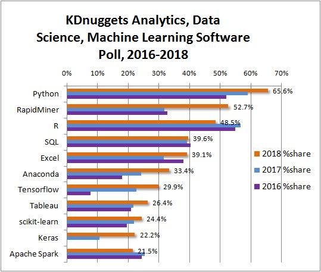

Data Wrangling with R for Beginners
========================================================
author: Jeho Park
date: November 28, 2018
autosize: true

Agenda
========================================================

- About R
- R Basics
- Working With Data
- Hands-On Project
- Further Learning

By the time you finish this workshop, you will have learned:
========================================================

* Why you want to learn R 
* Different types of data in R and how to work with them
* How to use built-in functions and help docs
* How to install new packages and to learn the details of the packages
* How to create simple plots 
* How to use pipe operators for better readability of your code
* How to subset and re-shape your data


About R
========================================================

- R is a language and environment for statistical computing and graphics.
- R is widely used in education, finance, software, medicine and more.
- The biggest draw of using R is the large amount of functionality through packages and its graphing capabilities. 
- However, R can have shortcomings in its speed (flexibility over performance) and the learning curve for non-programmers (duh!). 

How popular in general?
========================================================

IEEE Spectrum: Popular Programming Languages in 2018


How popular in Data Science/Machine Learning?
========================================================

KDnuggets Software Poll: Top Analytics/Data Science/ML Tools


R Basics
========================================================

Getting Started - RConsole
========================================================
- Upon opening RStudio, you will see the Console
  - 

Getting Started - RConsole
========================================================
- You can perform some calculations by typing into it.

```r
2+2
```

```
[1] 4
```

Getting Started - Variables
========================================================
- You can also use variables and assign them values.

```r
x <- 2
x+2
```

```
[1] 4
```

```r
y = x+1 # the same as <- but do not use it for assignment
x+y
```

```
[1] 5
```

Getting Started - R Environment
========================================================
- When you create a variable it will show up on the environment pane in RStudio


R Basics - Arithmetic Operators
========================================================
- Operators are symbols that use some input and *operate* on them.
- Arithmetic operators are our common mathematical symbols.

```r
x*x # Multiplication
```

```
[1] 4
```

```r
x/x # Division
```

```
[1] 1
```

```r
x^3 # Exponentiation
```

```
[1] 8
```

R Basics - Logical Operators
========================================================
- Logical operators output either True or False

```r
2 < 5  # Less Than
x >= 2 # Greater Than Or Equal To
x == 1 # Equal to. NOTE: This is different from "="
x != x # Not Equal to
```

R Basics - Data Types (Other scalars)
========================================================
- R can work with more than just numbers.

```r
class(x)
```

```
[1] "numeric"
```

```r
class("hello, world!") # The class function returns the data type of a variable or value.
```

```
[1] "character"
```

```r
class(x == y) 
```

```
[1] "logical"
```

R Basics - Data Types (Vectors)
========================================================
- Up until now, we have been working with single numbers and variables also known as scalars.
- In R, there are also vectors which are sequences of values.

```r
a <- c(1,2,3)
b <- c(3,2,1)
a*b # Most operations on a vector will be element-wise
```

```
[1] 3 4 3
```

R Basics - Data Types (Data Frames)
========================================================
- A data frame is used for storing rectangular data. It is a list of vectors of equal length.

```r
names <- c("John", "Kim", "Terry")
ages  <- c(21, 34, 16)
male  <- c(TRUE, FALSE, TRUE)
df <- data.frame(names, ages, male) 
```

R Basics - Built-In Functions (1)
========================================================
- Functions take input arguments and produce an output. R contains many functions that are built-in, some of which we have already seen [class(), c()]

```r
abs(-5) # Absolute Value
```

```
[1] 5
```

```r
sqrt(4) # Square Root
```

```
[1] 2
```
R Basics - Built-In Functions (2)
========================================================

```r
sum(a)  # Sum
```

```
[1] 6
```

```r
toupper("hello") # To Upper Case
```

```
[1] "HELLO"
```
R Basics - Built-In Functions (3)
========================================================

```r
sd(a) # Standard Deviation
```

```
[1] 1
```

```r
cor(a,b) # Correlation
```

```
[1] -1
```

R Basics - Libraries and Packages
========================================================
- R is known for its community and its libraries/packages
- Packages are collections of R functions, data, and compiled code in a well-defined format. The directory where packages are stored is called the library.
- We will install the dplyr package, a popular package for data manipulation


```r
install.packages('dplyr') # you can also use RStudio's Packages tab

# You should load dplyr package first to use any functions and datasets in the package
library('dplyr') 
```

R Basics - Help Docs
========================================================
- With all these packages and functions you may forget how to use one or need to remember which one to use.

```r
# This will search for usage of the hist function (exact match)
?hist

# This will search packages and functions mentioning histogram
??histogram
```


```r
# This will return the names of objects in the search list
apropos("hist")
```


```r
# All vignettes from all installed packages are listed
vignette() 
# try giving an argument, e.g., dplyr, to see a specific vignette
```

Exercise 1
==============

- Review of some basic R features
- Open exercise_1.Rmd (this is a R markdown file)


Working with Data (Data Wrangling)
========================================================

- What is Data Wrangling?
- Built-in Datasets
- Data Import (later in hands-on)
- Data Exploration
- Data Visualization
- Data Manipulation

Working with Data: So what is data wrangling?
========================================================
“It’s the ability to take a messy, unrefined source of data and wrangle it into something useful.”


Excerpt From: Bradley C. Boehmke, Ph.D. “Data Wrangling with R.”


Working with Data - Built-in Datasets 
========================================================
- R's datasets package has some built in datasets that we will be using.
    - The CO2 data frame has 84 rows and 5 columns of data from an experiment on the cold tolerance of the grass species Echinochloa crus-galli.

```r
help(CO2) # see what the dataset is about
CO2 # display all the contents of the data frame, CO2
```

Working with Data - Data Exploration (Head or Tail?)
========================================================

```r
# The head function shows the first few entries in a dataframe.
head(CO2)
```

```
  Plant   Type  Treatment conc uptake
1   Qn1 Quebec nonchilled   95   16.0
2   Qn1 Quebec nonchilled  175   30.4
3   Qn1 Quebec nonchilled  250   34.8
4   Qn1 Quebec nonchilled  350   37.2
5   Qn1 Quebec nonchilled  500   35.3
6   Qn1 Quebec nonchilled  675   39.2
```

```r
tail(CO2)
```

```
   Plant        Type Treatment conc uptake
79   Mc3 Mississippi   chilled  175   18.0
80   Mc3 Mississippi   chilled  250   17.9
81   Mc3 Mississippi   chilled  350   17.9
82   Mc3 Mississippi   chilled  500   17.9
83   Mc3 Mississippi   chilled  675   18.9
84   Mc3 Mississippi   chilled 1000   19.9
```

Working with Data - Data Exploration - Summary
========================================================

```r
# The summary function shows summary statistics.
summary(CO2)
```

```
     Plant             Type         Treatment       conc     
 Qn1    : 7   Quebec     :42   nonchilled:42   Min.   :  95  
 Qn2    : 7   Mississippi:42   chilled   :42   1st Qu.: 175  
 Qn3    : 7                                    Median : 350  
 Qc1    : 7                                    Mean   : 435  
 Qc3    : 7                                    3rd Qu.: 675  
 Qc2    : 7                                    Max.   :1000  
 (Other):42                                                  
     uptake     
 Min.   : 7.70  
 1st Qu.:17.90  
 Median :28.30  
 Mean   :27.21  
 3rd Qu.:37.12  
 Max.   :45.50  
                
```

Working with Data - Data Visualization
========================================================
- Basic plots such as histogram, box plot, and scatter plot are within a few key strokes away (type `boxp` and wait for it)


```r
hist(CO2$uptake) # Use help function for more plotting options
boxplot(CO2$conc)
plot(CO2$uptake, CO2$conc)
```
**Note that we used '$' to access (or extract) a variable (column/feature/etc) of a dataframe

Working with Data - Data Visualization - Boxplot
========================================================

```r
boxplot(CO2$conc)
```


```r
plot(CO2$uptake, CO2$conc)
```


Working with Data - Data Visualization - Scatterplot
========================================================

```r
plot(CO2$uptake, CO2$conc)
```


Working with Data - Data Manipulation
========================================================
- Dplyr is the most common package used for data exploration and transformation
- Dplyr functions: filter, select, arrange, mutate, summarise (plus group_by)

## Make sure you have installed dplyr package and loaded the package to your environment (how?)

orking with Data - Data Manipulation - Filter
========================================================
- ```filter``` with a logical operator on a value will filter in (or out) those observartions with the value.

```r
head(filter(CO2, Treatment=='nonchilled'))
low_uptake <- filter(CO2, uptake <= 15)
```

Working with Data - Data Manipulation - Select
========================================================
- ```select``` will extract only the variables (columns) that you choose

```r
head(select(CO2, Plant, conc, uptake), 3) 
```

Working with Data - Data Manipulation - Chaining
========================================================
- You can chain/pipe dplyr functions together
    - The infix (or pipe) operator '%>%' will feed the resulting object into the 1st paramater of the next function

```r
x <- select(filter(CO2, Treatment=='nonchilled'), Plant, conc, uptake) # OR
y <- CO2 %>% filter(Treatment=='nonchilled') %>% select(Plant, conc, uptake)
x == y
```

Working with Data - Data Manipulation - Arrange
========================================================
- ```arrange()``` sorts observations (rows) by a variable (column)

```r
# Use desc() to sort descending
CO2 %>% arrange(desc(uptake)) %>% head(3)
```

Working with Data - Data Manipulation - Mutate
========================================================
- ```mutate()``` creates new variables

```r
CO2 %>% mutate(conc_L = conc / 1000) %>% head()
```

Working with Data - Data Manipulation - Summarise
========================================================
- ```group_by()``` and ```summarise()``` work together to aggregate variables

```r
CO2 %>% 
  group_by(Type) %>% 
  summarise(avg_uptake = mean(uptake))
```

Working with Data - Data Manipulation - Tips
========================================================
- In datasets with a lot of variables, you can use select function to exclude certain variables by using the '-' operator ```select(CO2, -Plant)```
- When aggregating data you need an aggregate function such as mean, median, n (number of rows in a group), sum, etc.
- If your data has missing values, you need to add the parameter ```na.rm = TRUE```, this will skip any missing values.
- When working with data, the data manipulation process often takes more time than the analysis.

Further Learning - Beginner/Intermediate
========================================================
- Beginner/Intermediate Topics
    - User Defined Functions
    - Control Structures (if else)
    - Statistical Methods
    - Data Cleaning and Tidydata (!)
    - Data Visualization Libraries (ggplot2, plotly)
        - https://plot.ly/r/dashboard/

Further Learning - Advanced
========================================================
- Advanced Topics
    - Deep Learning 
    - Functional Programming
    - Object Oriented Programming (encapsulation, polymorphism, etc.)
    - Debugging Tools
    - Performance (e.g., shared-memory parallel processing)

Hands-On Project - Pro Tips
========================================================
- In this workshop, we have been using the console and the editoor, but when working on a project you will generally create an R project with a version control. This helps anyone reproduce their findings. Reproducibility is important!
- When using a script, you must run your code either all at once (Run All) or Line-by-Line. Ues keyboard shortcuts.

Hands-On Project - Reading the Data
========================================================
- Download the data to your computer at http://bit.ly/r-hands-on-s2018 if you haven't downloaded them from the GitHub repo.
- You can import the data to R either by code below or by clicking Import Dataset on the Environment Tab

```r
# You need to put the full path to the file in quotes or change the working directory [getwd(), setwd()]
Births <- read.csv("Births2015.csv")
Auto   <- read.csv("Auto.csv")
```

Hands-On Project - Analysis
========================================================
1. What is the name of the 1st car in the dataset, Auto?
2. What is the total number of babies born in 2015?
3. Make a boxplot of car mpg.
4. Make a histogram of number of births.  
5. How many babies are born on Wednesdays? (use pipe operator)
6. Which date had the least amount of babies born?
7. Is there a relationship between the number of cylinders and mpg? 
8. Plot the average mpg for cars of each number of cylinders.

Hands-On Project - Answers
========================================================
1. ```head(Auto,1)```: chevrolet chevelle malibu
2. ```sum(Births$births)```: 3978497
3. ```boxplot(Auto$mpg)```
4. ```hist(Births$births)```
5. ```Births %>% group_by(wday) %>% summarise(sum=sum(births)) %>% arrange(sum)```: 638513
6. ```Births %>% arrange(births) %>% head(3)```: (guess what date it was)
7. ```cor(Auto$mpg, Auto$cylinders)``` or ```plot(Auto$cylinders, Auto$mpg)```

Hands-On Project - Answer #8
========================================================

```r
x <- Auto %>% group_by(cylinders) %>% summarise(mean(mpg))
plot(x$cylinders, x$`mean(mpg)`)
```

Hands-On Project - Answer #8 - 2
========================================================

```r
plot(x$cylinders, x$`mean(mpg)`, type='o', xlab="Cylinders", ylab="Average MPG", main="Cylinders vs. Average MPG") # Cleaner Version
```

[FREE!] resources for your further study
========================================================
- Swirl (http://swirlstats.com/)
- DataCamp (https://www.datacamp.com/courses/tech:r)
- R for Data Science by Hadley Wickham (http://r4ds.had.co.nz/) (Free)
- Statistics.com (https://www.statistics.com/landing-page/r-courses/)
- Data Wragnling with R by Bradley Boehmke (free eBook from the library)
- The R Book by Michael Crawley (free eBook from the library)

